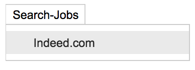
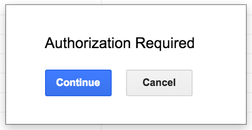
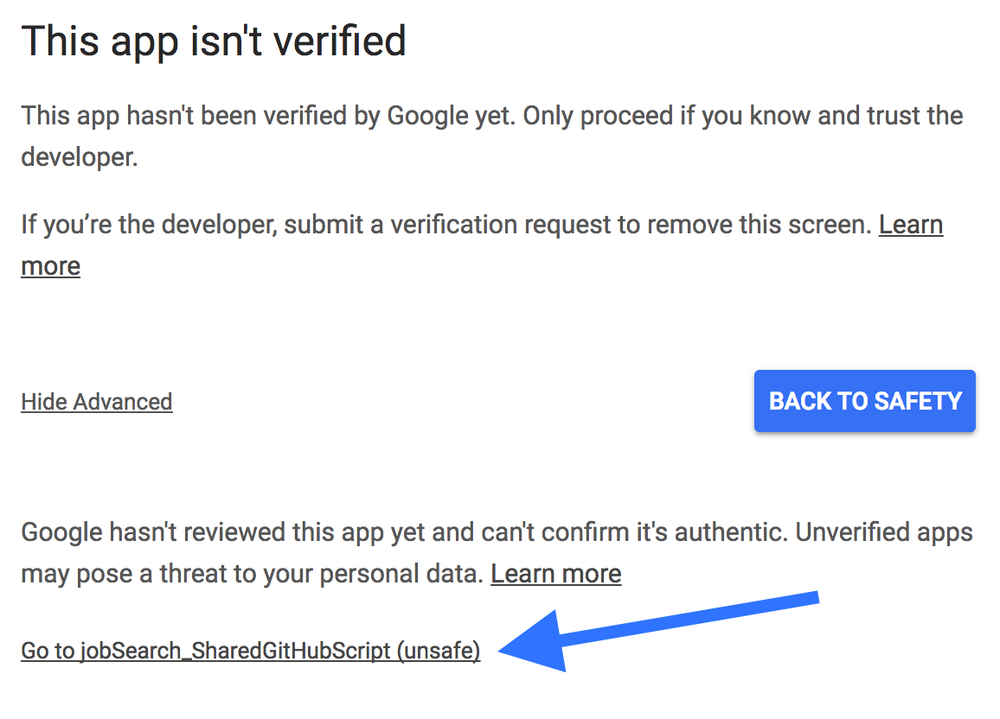
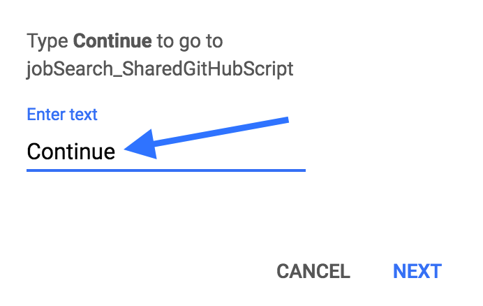

# <u>Overview</u>
I created this script uses to automate multiple job searches at once. The script uses Indeed.com API to search for various jobs within different cities. For example, if <i>Project Manager</i> + <i>Product Manager</i> and <i>Austin, TX</i> + <i>Boulder, CO</i> + <i>San Francisco, CA</i> are all added to the search query, a search will run for both job titles within each city, then return the results.

# <u>Initial Setup</u>

### Template Sheet
You will need a Google account to run this program. Navigate to my <a style="color:#0D6EE4" href="https://drive.google.com/open?id=0B5w_Rm6Jrg-PTG41cmE4cV9yS1E">jobSearch_Indeed</a> folder. Right click the <i>jobSearch_SharedGitHub</i> file, and select <i>Add to My Drive</i>. This will create a copy of the file in your google drive.

### Script Editor
Open the file from your drive and navigate to the menu bar. Click <i>tools</i> and select <i>Script editor</i>. A new tab should open in the browser titled <i>jobSearch_SharedGitHubScript</i> and it should have four files labeled:
1. <i>constants.gs</i>
2. <i>docInfo.gs</i>
3. <i>menuBar.gs</i>
4. <i>scrapeIndeed.gs</i>

If you can't locate these files, create them, and copy/paste the corresponding scripts located in this <i>GitHub</i> repository.

### Define the Search Query
If you want to change the parameters of the search navigate to the following paths and follow the formating and naming conventions provided. The job titles and locations I added as examples can be removed if desired.

* City/State 
Select <i>Tools</i> > <i>Script Editor</i> > <i>Constants.gs</i> > <i>locationArray</i> > add new locations to the array

* Job Title, Jobs to Avoid, or Salary 
Select <i>Tools</i> > <i>Script Editor</i> > <i>Constants.gs</i> > <i>jobSearch (object)</i> > <i>jobTitle (key/value pair) >
add desired values to each key/value pair

### Run the Search
The first time you try to run this app, <i>Google</i> will inform you the app must be approved. Select this <a style="color:#0D6EE4" href="https://support.google.com/cloud/answer/7454865">google clould help link</a> to learn how to verify the app. You can bypass the previous process by following these steps:
1. Navigate to the menu bar, click <i>Search-Jobs</i>, and select <i>Indeed.com</i>
 

 

2. A pop-up will appear letting you know authorization is required. Click the button labeled <i>Continue</i>.
 

 

3. Select the link labeled <i>Advanced</i>. Then select the <i>Google</i> account you wish to use.
 

 

4. Click the link at the bottom. It should be labeled with the name of the script being used to run this app. Unless you rename the script it should be labeled as <i>jobSearch_SharedGitHubScript</i>.
 

 

5. Type the word <i>Continue</i> in the text box and click <i>NEXT</i>.
 

 

6. Once verified, the app should run. But, if it doesn't, repeat step 1 and that should do the trick. The returned results will be organized first by the date each job was posted, then by the city it's located in. Delete any row containing an undesired job, and the job won't appear in future searches. 

### Automate the Search
This script can also be automated. Navigate to the menu bar. Click <i>tools</i> and select <i>Script editor</i>. Then navigate to the new menu bar, click <i>Edit</i>, then select <i>Current project's triggers</i>. Create a new automated trigger by clicking the link labeled <i>No triggers set up. Click here to add one now</i>. Make sure to select <i>initiate</i> from the first drop-down menu. This is the function that runs the job search. The remaining drop-down menus can be set to your preferences.
